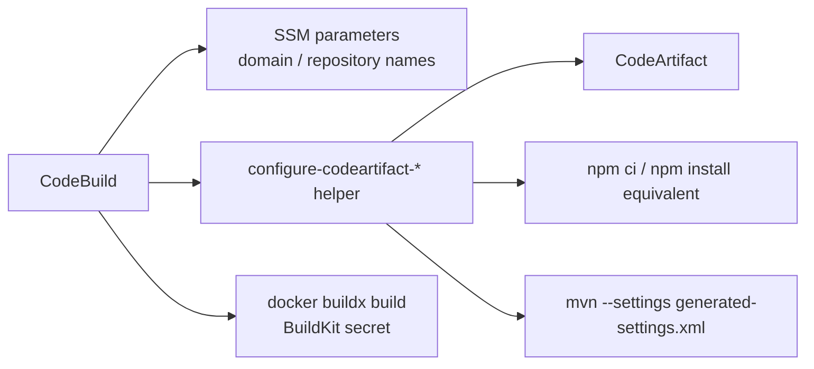

# P2-beta-02 CodeArtifact build integration

## Summary

Pipeline 内の npm / Maven 依存取得を CodeArtifact 経由に統一する。
Buildspec に長い認証処理を直書きせず、`infra/cdk/scripts/` 配下の Python helper script に寄せる。

## ユーザー要件

- token 入り `.npmrc` / `settings.xml` は git 管理しない。
- CodeBuild 実行時に短命 token を取得する。
- npm は AWS 公式方針どおり `aws codeartifact login --tool npm` を使う。
- Maven は一時 `settings.xml` と `${env.CODEARTIFACT_AUTH_TOKEN}` を使い、`mirrorOf=central` を設定する。
- Docker build 内の Maven 設定は BuildKit secret で渡す。

## 案

- 次の helper script を追加する。

```text
infra/cdk/scripts/configure-codeartifact-npm.py
infra/cdk/scripts/configure-codeartifact-maven.py
```

- helper script は AWS profile を受け取らず、CodeBuild の実行ロール認証に任せる。
- CodeArtifact domain / repository 名は DependencyStack が公開する SSM Parameter から CodeBuild environment variable として受け取る。
- 対象 CodeBuild は次に固定する。
  - Synth
  - Build & Test
  - Build Web Image
  - RunMigration

## ADR

- CodeArtifact endpoint は SSM や CloudFormation Output に保存せず、実行時に `aws codeartifact login` または `get-repository-endpoint` で取得する。
- `domain-owner` は SSM に保存しない。必要な実 account は CodeBuild 内で AWS 認証から取得する。
- Maven settings に token 実値を書かない。
- npm / Maven helper は処理が異なるため別ファイルにする。

## Implementation

- npm helper は `aws codeartifact login --tool npm` を実行する。
- Maven helper は token / endpoint を取得し、workspace 内に一時 `settings.xml` を生成する。
- Maven settings には CodeArtifact repository を mirror として設定する。
- Build Web Image は Docker build arg ではなく BuildKit secret で Maven settings を渡す。
- CodeBuild project role には次を付与する。
  - `codeartifact:GetAuthorizationToken`
  - `codeartifact:GetRepositoryEndpoint`
  - `codeartifact:ReadFromRepository`
  - `sts:GetServiceBearerToken`
- CodeArtifact系権限は domain / repository ARN に可能な範囲で絞る。`sts:GetServiceBearerToken` はAWS仕様に従う。



## Verification

- helper script の入力環境変数不足時の失敗を unit test または dry-run で確認する。
- CDK templateで対象 CodeBuild project role に CodeArtifact IAM があることを確認する。
- buildspec / CodeBuild commands が helper script を呼ぶことを確認する。
- Docker build commandが BuildKit secret を使い、tokenを build arg に入れていないことを確認する。
- token、endpoint実値、account IDが Outputs / docs に出ていないことを確認する。
- 実際の npm / Maven 依存取得は `P2-beta-09` の Pipeline 完走で確認する。

## Assumptions

- CodeArtifact package retention / cleanup の独自実装はしない。
- 依存追加や lockfile 更新が必要な場合は、ユーザーの明示許可を得てから npm 依存操作を実行する。
