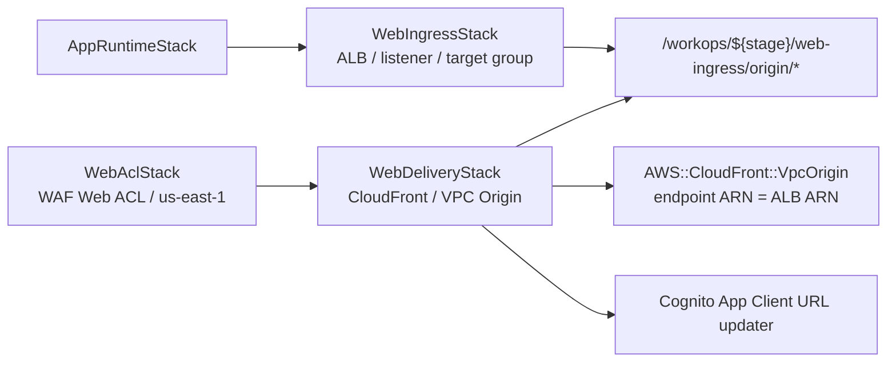

# P2-beta-05 WebDeliveryStack / WebIngressStack split

## Summary

既存 `EdgeStack` を `WebDeliveryStack` と `WebIngressStack` に分割する。
目的は CloudFront の長い deploy を完全に消すことではなく、CloudFront / VPC Origin / Cognito URL updater を長時間・低頻度変更側へ隔離すること。
あわせて CloudFront 前段の WAF Web ACL を `WebAclStack` として分離し、`WebDeliveryStack` から参照する。

## ユーザー要件

- 旧 `EdgeCloudFrontStack` / `EdgeAlbStack` という命名は採用しない。
- `WebDeliveryStack` / `WebIngressStack` を使う。
- CloudFront deploy時間が長い既存実測を根拠として記録する。
- 通常運用を複雑にしない。
- CloudFront 前段に AWS WAF Web ACL を追加する。
- WAF log は通常無効とし、検証時のみ有効化する。

## 案

- `WebIngressStack` は ALB、listener、target group、ALB SG ingress を所有する。
- `WebDeliveryStack` は CloudFront Distribution、CloudFront VPC Origin、Cognito URL updater を所有する。
- `WebAclStack` は CloudFront 用 WAF Web ACL を所有する。
- `WebIngressStack` は CloudFront VPC Origin の接続先として使う Web ingress origin contract を SSM Parameter Store に公開する。
- Web ingress origin contract は ALB ARN、ALB DNS name、ALB security group ID の3値で構成する。
- `WebDeliveryStack` は Web ingress origin contract を CloudFormation deploy時解決で読む。synth時lookupは使わない。
- `WebDeliveryStack` は SSM から復元した `IApplicationLoadBalancer` を `VpcOrigin.withApplicationLoadBalancer` に渡して `AWS::CloudFront::VpcOrigin` を作る。
- `WebDeliveryStack` は `WebAclStack` の Web ACL ARN を CloudFront Distribution に関連付ける。
- `AppRuntimeStack` と `WebIngressStack` の listener / target group 連携は props 参照を維持する。

## ADR

- `WebDeliveryStack` はライフサイクル分類上は常設。
- `WebAclStack` は CloudFront 用 Web ACL の AWS 制約に合わせて `us-east-1` の常設Stackとする。
- `WebDeliveryStack` は `WebIngressStack` の Web ingress origin contract を必要とするため、Pipeline stage 上は `WebIngressStack` 後に置く。
- `WebIngressStack` 再作成時に CloudFront / VPC Origin 更新待ちが発生し得ることは、コスト優先の代償として受け入れる。
- 既存 `EdgeStack` deploy 実測は約15分11秒で、大半は CloudFront VPC Origin と Distribution 作成時間だった記録を根拠にする。
- WAF は AWS Managed Rules Common Rule Set を Count mode で有効化し、ブロック運用は Phase 2β では行わない。
- CloudFront VPC Origin の `VpcOriginEndpointConfig.Arn` に渡す値は VPC Origin 自体の ARN ではなく、origin endpoint である ALB ARN とする。
- CloudFront Distribution と `AWS::CloudFront::VpcOrigin` は同じ `WebDeliveryStack` で管理し、Distribution から VPC Origin ID を同一Stack内参照する。

## Implementation

- SSM path は次に固定する。

```text
/workops/${stage}/web-ingress/origin/alb-arn
/workops/${stage}/web-ingress/origin/alb-dns-name
/workops/${stage}/web-ingress/origin/alb-security-group-id
```

- `WebIngressStack` が上記parametersを作成し、`RemovalPolicy.DESTROY` にする。
- `WebDeliveryStack` は parameters がない場合 deploy失敗でよい。fallback origin は作らない。
- `WebDeliveryStack` は `ApplicationLoadBalancer.fromApplicationLoadBalancerAttributes` で `IApplicationLoadBalancer` を復元する。
- `ApplicationLoadBalancer.fromApplicationLoadBalancerAttributes` には `loadBalancerArn`、`loadBalancerDnsName`、`securityGroupId` を渡す。
- `WebDeliveryStack` は復元した `IApplicationLoadBalancer` を `VpcOrigin.withApplicationLoadBalancer` に渡し、既存 `EdgeStack` と同じCDK L2経路で VPC Origin を作る。
- L1 `CfnVpcOrigin` を直接組み立てる実装は採用しない。
- `WebAclStack` は AWS Managed Rules Common Rule Set だけを作る。
- Bot Control、Fraud Control、CAPTCHA、Challenge、Marketplace managed rule は使わない。
- WAF log は既定無効とし、CDK context flag で有効化した場合だけ LogGroup と LoggingConfiguration を作る。
- `infra/cdk/custom-resources/cognito-client-url-updater/` を `infra/cdk/lambda/cognito-client-url-updater/` に移す。
- Cognito URL updater は Node.js 24.x に更新し、AWS SDKをbundleする。
- Lambda実行コード置き場は `infra/cdk/lambda/` に統一する。
- NodejsFunction共通bundling helperは作らない。



## Verification

- CDK build/test/synth を実行する。
- Templateで `WebIngressStack` と `WebDeliveryStack` が分かれていることを確認する。
- Web ingress origin contract のSSM parametersが `WebIngressStack` 所有であることを確認する。
- `WebDeliveryStack` が SSM deploy時解決で ALB ARN、ALB DNS name、ALB security group ID を使うことを確認する。
- `WebDeliveryStack` template の `AWS::CloudFront::VpcOrigin` が `VpcOriginEndpointConfig.Arn` に ALB ARN を使うことを確認する。
- `WebDeliveryStack` template の CloudFront Distribution が同一Stack内の VPC Origin ID を参照することを確認する。
- `WebAclStack` が CloudFront scope の Web ACL を作ることを確認する。
- AWS Managed Rules Common Rule Set が Count mode であることを確認する。
- WAF log が既定無効で、context flag有効時だけLoggingConfigurationを作ることを確認する。
- `WebDeliveryStack` の CloudFront Distribution が Web ACL ARN を使うことを確認する。
- Cognito URL updater runtimeが Node.js 24.x であることを確認する。
- Cognito URL updater handler単体テストを追加し、`DescribeUserPoolClient` から既存設定を取得し、URLだけを `UpdateUserPoolClient` で更新する流れをmock検証する。
- 実 CloudFront deploy / Cognito URL更新 / CloudFront到達は `P2-beta-08` で確認する。

## Assumptions

- CloudFront更新時間はSSM化では消えない。
- SSM化の目的はCDK construct直接参照を避け、Stack間依存と更新波及を弱めること。
