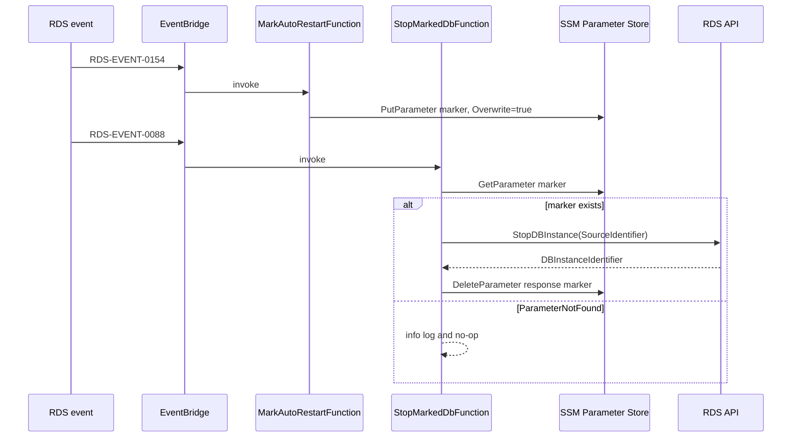

# P2-beta-06 DataPauseStack

## Summary

RDSの7日自動起動に対する再停止制御を `DataPauseStack` として追加する。
CloudTrail主体判定や定期Schedulerは使わず、RDS event ID と SSM marker で制御する。

## ユーザー要件

- CloudTrail `LookupEvents` は採用しない。
- `RDS-EVENT-0154` と `RDS-EVENT-0088` を使う。
- `RDS-EVENT-0087` は使わない。
- Lambdaは2個に分け、event ID分岐を入れない。
- Lambdaは広い `try/catch` で握りつぶさず、失敗はLambda Errors alarmへ出す。

## 案

- `DataPauseStack` は常設。
- EventBridge Rule 2個、Lambda 2個を作る。
- `MarkAutoRestartFunction` は `RDS-EVENT-0154` 専用で、SSM markerを作る。
- `StopMarkedDbFunction` は `RDS-EVENT-0088` 専用で、markerがある場合だけ `StopDBInstance` を呼ぶ。
- DataPause用 LogGroup は `LogsStack` が所有する。
- Lambda Errors alarm は `DependencyStack` の ops notification topic へ通知する。

## ADR

- marker path は `/workops/${stage}/data-pause/${sourceIdentifier}/auto-restart-marker`。
- marker value は固定文字列 `RDS-EVENT-0154`。
- `StopMarkedDbFunction` は `StopDBInstance` response の `DBInstanceIdentifier` から marker path を組み立てて削除する。
- `DescribeDBInstances` は呼ばない。
- `ParameterNotFound` は正常系 no-op とし、info logを出す。
- DataPauseはPipelineのRDS start / stopとは無関係。

## Implementation



- Lambda codeは次に置く。

```text
infra/cdk/lambda/data-pause/mark-auto-restart.ts
infra/cdk/lambda/data-pause/stop-marked-db.ts
```

- Runtimeは Node.js 24.x。
- AWS SDK v3はruntime同梱に依存せずbundleする。
- `aws-sdk-client-mock` で handler単体テストを追加する。
- IAMは対象DB ARNと対象marker parameter ARNへ限定する。

## Verification

- CDK build/test/synth を実行する。
- Template testで次を確認する。
  - EventBridge Rule 2個
  - `RDS-EVENT-0154` rule → `MarkAutoRestartFunction`
  - `RDS-EVENT-0088` rule → `StopMarkedDbFunction`
  - rule pattern に `source` / `detail-type` / `EventID` / `SourceIdentifier`
  - Node.js 24.x
  - SSM/RDS IAM が対象ARNに絞られている
  - Lambda Errors alarm が ops notification topicへ通知する
  - LogGroupが `LogsStack` 由来である
- Handler testで次を確認する。
  - marker作成は `PutParameter` with `Overwrite=true`
  - markerなしは `ParameterNotFound` no-op
  - markerありは `StopDBInstance`
  - response の `DBInstanceIdentifier` から `DeleteParameter`
  - `StopDBInstance` / `DeleteParameter` 失敗は握りつぶさない
- 実 `RDS-EVENT-0154` 再現は必須にしない。

## Assumptions

- RDS 7日自動起動そのものの実再現は時間制約上このtaskの必須条件にしない。
- 手動起動でも `RDS-EVENT-0088` は発火し得る前提で、markerなしno-opを正常系とする。

