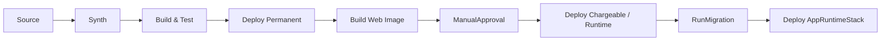

# P2-beta-08 Pipeline stage recomposition

## Summary

`P2-beta-01` から `P2-beta-07` の成果を統合し、Pipeline stage順序とStack配置を再構成する。
この task で実AWS deployと改善後Pipeline完走確認を必須完了条件にする。

## ユーザー要件

- デプロイ完走まで行う。
- PipelineはRDS start / stop運用に関心を持たない。
- ManualApprovalは課金が始まる手前の関門にする。
- `Build Images` は `Build Web Image` にリネームする。
- `WebDeliveryStack` は常設だが、stage上は `WebIngressStack` 後に置くことを明記する。
- ECS Blue/Green alarm は target health 中心の2本にする。

## 案

Pipeline stage順序は次に固定する。

```text
1. Source
2. Synth
3. Build & Test
4. Deploy Permanent
5. Build Web Image
6. ManualApproval
7. Deploy Chargeable / Runtime
8. RunMigration
9. Deploy AppRuntime
```



## ADR

- CDK Pipelines self-mutationは維持する。
- Deploy Permanent対象は `FoundationStack`、`LogsStack`、`IdentityStack`、`RegistryStack`、`DataPauseStack`、`WebAclStack`。
- Deploy Chargeable / Runtime対象順序は `EgressStack`、`WebIngressStack`、`WebDeliveryStack`、`DataStack`、`MigrationRunnerStack`。
- `WebDeliveryStack` は常設分類だが、ALB DNS name SSM parameterのため `WebIngressStack` 後に置く。
- RunMigration成功後に `AppRuntimeStack` をdeployする。

## Implementation

- `PipelineStack` から旧 migration image / migration RunTask / BuildMigrationImage を削除する。
- Build Web Image はWeb image repository / Web cache repositoryだけを使う。
- Synth / Build & Test / Build Web Image / RunMigration は CodeArtifact helperを使う。
- `RunMigration` は `MigrationRunnerStack` の CodeBuild project を起動する。
- Pipeline failure / ManualApproval通知は DependencyStack の ops notification topic を使う。
- ECS Native Blue/Green deployment failure detection は次の2本のCloudWatch Alarmを使う。
  - `HealthyHostCount < 1`
  - `UnHealthyHostCount > 0`
- `HTTPCode_Target_5XX_Count` と `TargetResponseTime` はPhase 2βでは採用しない。

## Verification

- AWS profile / region を明示する。
- AWS credential環境変数を削除してprofileを使う。
- `aws sts get-caller-identity --region $env:AWS_REGION` で認証先を確認する。
- `cdk diff --all`
- 初回bootstrap例外手順または `cdk deploy --all`
- Pipeline self-mutation
- `main` push起点のPipeline run
- Synth
- Build & Test
- Deploy Permanent
  - `WebAclStack` を含む
- Build Web Image
- ManualApproval
- Deploy Chargeable / Runtime
- RunMigration
- Deploy AppRuntime
- CloudFront default domain経由到達
- ECS Blue/Green alarm が `HealthyHostCount` / `UnHealthyHostCount` の2本であること
- HTTP 5xx / TargetResponseTime alarmがdeployment failure detectionに含まれないこと
- Cognito Hosted UI / ブラウザ操作はユーザー確認として記録する。

## Assumptions

- 実 account ID、SSO role ARN、credential値、public IP、RDS実endpoint、secret値は記録しない。
- RDS停止中ならRunMigrationは失敗し得る。PipelineはRDS start / stopを行わない。
