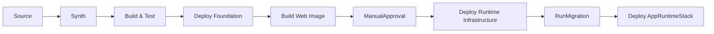

# P2-beta-09 Pipeline stage recomposition

## Summary

`P2-beta-01` から `P2-beta-08` の成果を統合し、ADR-067 に合わせて CDK Pipelines の Stage 境界と Stack 配置を再構成する。
Stage 境界をまたぐ construct 参照は廃止し、非 secret 値は SSM contract または明示名で受け渡す。

## ユーザー要件

- デプロイ完走まで行う。
- PipelineはRDS start / stop運用に関心を持たない。
- ManualApprovalは課金が始まる手前の関門にする。
- `Build Images` は `Build Web Image` にリネームする。
- `WebDeliveryStack` は常設分類だが、Pipeline stage上は `WebIngressStack` 後に置くことを明記する。
- Source actionは `P2-beta-07` で確定したsource branchをfilterする。
- ECS Blue/Green alarm は target health 中心の2本にする。
- 実デプロイに成功したら、デプロイ時間を計測して記録する。
- 実デプロイに失敗した場合は、必ず確認できた原因をこのtask文書に記録する。

## 案

Pipeline stage順序は次に固定する。

```text
1. Source
2. Synth
3. Build & Test
4. Deploy Foundation
5. Build Web Image
6. ManualApproval
7. Deploy Runtime Infrastructure
8. RunMigration
9. Deploy AppRuntime
```



## ADR

- CDK Pipelines self-mutationは維持する。
- Source actionのbranch filterは `P2-beta-07` のsource branch方針を維持する。
- `FoundationStage` 対象は `FoundationStack`、`LogsStack`、`IdentityStack`、`RegistryStack`、`DataPauseStack`。
- `RuntimeInfrastructureStage` 対象は `DataStack`、`EgressStack`、`WebAclStack`、`WebIngressStack`、`MigrationRunnerStack`、`WebDeliveryStack`。
- `AppRuntimeStage` 対象は `AppRuntimeStack`。
- `WebDeliveryStack` は Web ingress origin contractをSSMから読み、CloudFront Web ACL ARN は同じ `RuntimeInfrastructureStage` 内の `WebAclStack` から cross-region reference で受け取る。
- `RunMigration` 成功後に `AppRuntimeStack` をdeployする。
- `StringParameter.valueFromLookup` と `Vpc.fromLookup` は使わず、consumer Stack 内で `StringParameter.valueForStringParameter` を使う。
- subnet list token は使わず、Phase 2β は 2AZ 分の subnet ID / AZ / route table ID を個別 contract として扱う。

## Implementation

- `PipelineStack` から旧 migration image / migration RunTask / BuildMigrationImage を削除する。
- Build Web Image はWeb image repository / Web cache repositoryだけを使う。
- Synth / Build & Test / Build Web Image / RunMigration は CodeArtifact helperを使う。
- `RunMigration` は `MigrationRunnerStack` の CodeBuild project を起動する。
- Pipeline failure / ManualApproval通知は DependencyStack の ops notification topic を使う。
- `FoundationStack`、`IdentityStack`、`RegistryStack`、`WebAclStack`、`WebIngressStack`、`WebDeliveryStack` は非 secret contract を SSM Standard Parameter に公開する。
- `DataStack`、`EgressStack`、`WebIngressStack`、`MigrationRunnerStack`、`WebDeliveryStack`、`AppRuntimeStack` は必要値を自 Stack scope 内で contract から復元する。
- DB password、CodeArtifact authorization token、credential値は SSM contract に置かない。
- ECS Native Blue/Green deployment failure detection は次の2本のCloudWatch Alarmを使う。
  - `HealthyHostCount < 1`
  - `UnHealthyHostCount > 0`
- `HTTPCode_Target_5XX_Count` と `TargetResponseTime` はPhase 2βでは採用しない。

## Verification

- ローカルでは Pipeline `BuildAndTest` と同じ品質ゲートとして `npm run build`、`npm run test`、`npm run lint`、`npm run format:check` を実行する。
- AWS接続、`cdk diff`、`cdk deploy`、Pipeline実走確認は、ユーザーの明示依頼がある場合だけ実行する。
- AWS profile / region を明示する。
- AWS credential環境変数を削除してprofileを使う。
- `aws sts get-caller-identity --region $env:AWS_REGION` で認証先を確認する。
- CloudFront 用 WAF と CDK Pipelines cross-region support のため、実 deploy 前に `ap-northeast-1` と `us-east-1` の両方が CDK bootstrap 済みであることを確認する。
- `us-east-1` bootstrap は `cdk.json` のない directory から CDK CLI を直接呼び、WorkOps app の synth を走らせない。
- `cdk diff '*'`
- 初回bootstrap例外手順または `cdk deploy '*'`
- 実デプロイ成功時は、開始時刻、終了時刻、所要時間、主要な長時間 stack / Pipeline stage を記録する。
- 実デプロイ失敗時は、失敗した Stack / resource、確認できた原因、次に必要な対応を記録する。
- Pipeline self-mutation
- source branch push起点のPipeline run
- Synth
- Build & Test
- Deploy Foundation
- Build Web Image
- ManualApproval
- Deploy Runtime Infrastructure
- RunMigration
- Deploy AppRuntime
- CloudFront default domain経由到達
- ECS Blue/Green alarm が `HealthyHostCount` / `UnHealthyHostCount` の2本であること
- HTTP 5xx / TargetResponseTime alarmがdeployment failure detectionに含まれないこと
- Cognito Hosted UI / ブラウザ操作はユーザー確認として記録する。

## Assumptions

- 実 account ID、SSO role ARN、credential値、public IP、RDS実endpoint、secret値は記録しない。
- RDS停止中ならRunMigrationは失敗し得る。PipelineはRDS start / stopを行わない。

## Follow-up issues

- 2026-06-29: 現在の Pipeline は source branch の任意変更で `Synth`、`BuildAndTest`、`DeployFoundation`、`BuildWebImage` まで再実行し、変更がない stack / Docker image に対しても重い品質ゲートや image build を繰り返す。CDK deploy / CloudFormation は no-change change set を扱えるが、CodePipeline / CodeBuild stage 自体の起動コストと待ち時間は残る。AWS CodePipeline V2 の trigger file path filter は monorepo / path単位の不要な起動抑制に使えるため、infra変更、web app変更、docs変更、runtime deployをどの Pipeline / trigger / stage に分けるべきかを P2-beta 後続課題として整理する。あわせて CodeBuild cache、Docker layer cache、外部 buildx cache、BuildAndTest の分割、Docker image build の差分判定を検討する。
  - Reference: https://docs.aws.amazon.com/codepipeline/latest/userguide/pipelines-triggers.html
  - Reference: https://docs.aws.amazon.com/codebuild/latest/userguide/build-caching.html
  - Reference: https://docs.aws.amazon.com/codebuild/latest/userguide/caching-local.html

## Failure records

- 2026-07-02: 日常WEB修正の初回 push 起点 Pipeline execution は `DeployFoundation` の `BuildAndTest` で失敗した。原因は `apps/web/src/main/java/com/example/workops/common/web/HomeController.java` の Spotless formatting 違反をローカルの `spotless:check` で事前検出できていなかったため。対応として `mvn spotless:apply` 後に `mvn spotless:check '-Dtest=HomeControllerTests,HomeControllerWebTests' test` を成功させ、formatter 修正 commit を push して再実行した。
- 2026-07-02: Pipeline CDK deploy 直後に作成起点の Pipeline execution が開始されたが、Source stage の `GitHubSource` で失敗した。原因は CodeConnection `workops-dev-github` が `PENDING` で、GitHub 認可が未完了だったため。次に必要な対応は、ユーザーが AWS Console で CodeConnection を認可してから Pipeline を再実行すること。
- 2026-07-02: orphan bucket cleanup 後の Pipeline CDK deploy は `DependencyStack` が no changes まで進んだが、`workops-dev-pipeline-support-us-east-1` の security-sensitive update 承認で停止した。原因は非 TTY 実行環境で CDK の approval prompt に応答できず、`--require-approval never` を明示承認なしに使えないため。次に必要な対応は、`npx cdk deploy DependencyStack PipelineStack --profile $env:AWS_PROFILE --require-approval never` の実行可否を明示確認してから Pipeline CDK deploy を再実行すること。
- 2026-07-02: Pipeline CDK deploy は `DependencyStack` 作成完了後、`PipelineStack` の前提となる `workops-dev-pipeline-support-us-east-1` の changeset 作成で失敗した。原因は cross-region replication bucket が CloudFormation 管理外の既存 bucket として残っており、同名 `AWS::S3::Bucket` を新規作成できなかったため。`workops-dev-dependency` は `CREATE_COMPLETE`。次に必要な対応は、既存 artifact 削除を伴う orphan bucket cleanup の明示承認を得たうえで、support stack 記録と該当 bucket を対象限定で削除し、Pipeline CDK deploy を再実行すること。
- 2026-06-29: `workops-dev-pipeline-support-us-east-1` の `AWS::S3::BucketPolicy` 作成が `Invalid principal in policy` で失敗した。原因は `us-east-1` の CDK bootstrap が未実施で、cross-region support bucket policy が参照する CDK bootstrap deploy role が存在しなかったため。対応として、CloudFront / WAF / CDK Pipelines cross-region support を使う前提準備に `us-east-1` の CDK bootstrap を追加する。
- 2026-06-29: `npx cdk bootstrap --profile ...` を `infra/cdk` で環境指定なしに実行し、`WORKOPS_SOURCE_BRANCH environment variable is required` で失敗した。原因は `cdk.json` の app synth が走り、bootstrap に不要な WorkOps app entrypoint の必須環境変数検証に入ったため。対応として、bootstrap は `aws://<AWS account>/<region>` の環境を明示して実行する。
- 2026-06-29: `infra/cdk` で `aws://<AWS account>/us-east-1` を指定して `npx cdk bootstrap` を実行しても、`cdk.json` の app synth が走り `WORKOPS_SOURCE_BRANCH environment variable is required` で失敗した。原因は working directory の `cdk.json` が bootstrap 時にも読まれたため。対応として、bootstrap は `cdk.json` のない directory から CDK CLI 実体を直接呼ぶ。
- 2026-06-29: failed cross-region support stack の `ROLLBACK_COMPLETE` 記録と、失敗時に残った replication bucket の version / delete marker が再 deploy の妨げになり得る状態だった。対応として、対象を failed support stack に限定して stack 記録と残存 bucket を削除した。
- 2026-06-29: `PipelineStack` の更新が `DELETE_FAILED state and can not be updated` で止まった。原因は過去の `workops-dev-pipeline` 削除が artifact bucket を削除できず `DELETE_FAILED` のまま残っていたため。対応として、削除済み PipelineStack に残った artifact bucket を空にして stack 削除を完了させてから再 deploy する。
- 2026-06-29: `PipelineStack` 作成直後の Pipeline 実行が Source stage で失敗した。原因は `workops-dev-github` CodeConnection が `PENDING` で、GitHub 認可が未完了だったため。対応として、ユーザーが AWS Console で CodeConnection を認可してから source branch push 起点または手動 start で Pipeline を再実行する。
- 2026-06-29: CodeConnection 認可後の Pipeline 実行が Synth stage で失敗した。原因は `npm ci` が `package.json` と `package-lock.json` の不整合を検出し、lock file に `@emnapi/core` / `@emnapi/runtime` が不足していたため。あわせて CodeBuild 実行 Node.js が 18 系で、依存 package が Node 20 以上を要求している警告も出ていた。対応として、lock file 同期と CodeBuild Node.js runtime を確認・修正してから Pipeline を再実行する。
- 2026-06-29: `nodejs: 24` 修正を push した後の push 起点 Pipeline 実行も Synth stage で失敗した。原因は Pipeline 自身の `Synth` CodeBuild project がまだ旧 `PipelineStack` 定義のままで、self-mutation に到達する前に Node.js 18 / npm 10 の `npm ci` で落ちたため。対応として、ローカル CDK deploy で `PipelineStack` の CodeBuild BuildSpec を先に更新してから Pipeline を再実行する。
- 2026-06-29: ローカル CDK deploy で `Synth` CodeBuild project を `nodejs: 24` に更新した後の Pipeline 実行も Synth stage で失敗した。原因は Node.js 24 / npm 11 でも `npm ci` が lock file の `@emnapi/core` / `@emnapi/runtime` 不足を検出したため。対応として、`infra/cdk` の devDependency と lock file に `@emnapi/core` / `@emnapi/runtime` を追加する。
- 2026-06-29: `@emnapi/core` / `@emnapi/runtime` 追加後の push 起点 Pipeline 実行は `Synth`、`SelfMutate`、`Assets` まで成功したが、`DeployPermanent` の `BuildAndTest` で失敗した。原因はローカル確認で `npm run lint` と `npm run format:check` を Pipeline と同じ品質ゲートとして実行しておらず、ESLint エラーを事前検出できなかったため。対応として、ローカル検証項目を Pipeline `BuildAndTest` と揃え、lint / format も必須確認に含める。
- 2026-06-29: `BuildAndTest` 修正後の push 起点 Pipeline 実行は `DeployPermanent` まで成功したが、`BuildWebImage` で失敗した。原因は `apps/web/Dockerfile` が `eclipse-temurin:25-jdk` を Docker Hub から匿名 pull し、Docker Hub の pull rate limit に当たったため。CodeArtifact は Maven / npm dependency 管理であり、Docker base image は registry 管理のため対象外。対応として、Pipeline の Docker base image 方針を Docker Hub 直 pull から AWS 側 registry / Amazon Corretto に改め、build stage は `public.ecr.aws/amazoncorretto/amazoncorretto:25-al2023`、runtime stage は `public.ecr.aws/amazonlinux/amazonlinux:2023-minimal` と `java-25-amazon-corretto-headless` にする。
- 2026-06-29: Amazon Corretto / Amazon Linux 2023 へ変更したローカル Docker image は build できたが、Pipeline 同等の Trivy scan が `tools.jackson.core:jackson-databind` で HIGH / MEDIUM を検出して失敗した。原因は Spring Boot parent が管理する Jackson BOM が脆弱性修正版より古かったため。対応として、Trivy gate は緩めず、`apps/web/pom.xml` の `jackson-bom.version` を修正版へ上げて jar 内 dependency を更新する。
- 2026-06-29: Pipeline 環境に合わせた `linux/arm64` のローカル Docker image を amd64 のローカルホストで起動しようとして `exec format error` で失敗した。原因は image architecture と Docker host architecture の不一致。対応として、Pipeline 事前確認は `linux/arm64` build / Trivy scan で行い、ローカル実起動確認は同じ Dockerfile から `linux/amd64` image を別 tag で build して行う。
- 2026-06-29: Amazon Corretto / Amazon Linux 2023 へ変更後の push 起点 Pipeline 実行は `DeployPermanent` の `BuildAndTest` で失敗した。原因は Maven integration test の Testcontainers が `mysql:8.4` を Docker Hub から匿名 pull し、Docker Hub の pull rate limit に当たったため。対応として、Testcontainers の MySQL image は ECR Public mirror を `mysql` compatible substitute として使い、CodeBuild の使い捨て build host では Ryuk を無効化して Docker Hub 直 pull を避ける。
- 2026-06-29: ManualApproval 承認後の Pipeline 実行は `DeployRuntimePrereq` の `workops-dev-web-delivery.Prepare` で失敗した。原因は `WebAclStack` が CloudFront 用 Web ACL ARN contract を `us-east-1` の SSM Parameter Store に作成し、`ap-northeast-1` の `WebDeliveryStack` が同名 parameter を読もうとして region 境界で見つからなかったため。対応として、Pipeline stage 名を `DeployFoundation` / `DeployRuntimeInfrastructure` に改め、`WebAclStack` と `WebDeliveryStack` を同じ `RuntimeInfrastructureStage` に置き、CloudFront Web ACL ARN は SSM ではなく CDK cross-region reference で渡す。
- 2026-06-29: `DeployRuntimeInfrastructure` へ stage 名を変更した後の Pipeline 実行は `workops-dev-data.Deploy` で失敗した。原因は `DataStack` の RDS master secret が `/workops/dev/db/master` という固定 secret 名を持つ一方、stage rename により CDK logical ID が変わり、既存 secret を参照ではなく新規作成しようとして `AlreadyExists` になったため。対応として、RDS / secret / security group など既存 stateful resource を持つ stack は stage rename で logical ID が変わる影響を明示的に診断し、既存 physical resource を再作成しない形に修正してから再実行する。

## Deployment records

- 再計測のため、過去の計測記録は削除した。
- 2026-07-02: Pipeline CDK deploy は `npx cdk deploy DependencyStack PipelineStack --profile $env:AWS_PROFILE --require-approval never` を 21:40:11 +09:00 に開始し、21:42:21 +09:00 に完了した。所要時間は 00:02:10。`DependencyStack` は no changes、`workops-dev-pipeline-support-us-east-1` は作成完了し deploy time 25.75 秒、`PipelineStack` は作成完了し deploy time 71.81 秒だった。
- 2026-07-02: Pipeline execution `f833d8a6-6d47-42f8-b346-ffd2f44ae598` は 21:45:46 +09:00 に開始し、22:36:01 +09:00 に成功した。wall clock は 00:50:15。ManualApproval は 22:04:18 +09:00 から 22:05:09 +09:00 までの 00:00:50 で、計測対象から除外する。ManualApproval 除外後の Pipeline 実行時間は 00:49:25。
- 2026-07-02: 日常WEB修正の Pipeline execution `6c9c30af-a27e-4219-9606-cbfd48fc9fe8` は 22:54:07 +09:00 に開始し、23:20:17 +09:00 に成功した。wall clock は 00:26:10。ManualApproval は 23:07:26 +09:00 から 23:09:01 +09:00 までの 00:01:35 で、計測対象から除外する。ManualApproval 除外後の Pipeline 実行時間は 00:24:34。`BuildWebImage` は 00:03:36、`RunMigration` は 00:01:02、`workops-dev-app-runtime` deploy は 00:07:47 だった。

### Pipeline execution phase time - 1st run

| Stage / Action | Start | End | Duration | Result |
| --- | --- | --- | --- | --- |
| Source / GitHubSource | 21:45:46 | 21:45:50 | 00:00:03 | Succeeded |
| Build / Synth | 21:45:50 | 21:48:25 | 00:02:35 | Succeeded |
| UpdatePipeline / SelfMutate | 21:48:26 | 21:50:30 | 00:02:04 | Succeeded |
| Assets / File assets | 21:50:31 | 21:51:35 | 00:01:04 | Succeeded |
| DeployFoundation / BuildAndTest | 21:51:36 | 21:55:43 | 00:04:07 | Succeeded |
| DeployFoundation / workops-dev-foundation | 21:55:44 | 21:58:00 | 00:02:16 | Succeeded |
| DeployFoundation / workops-dev-identity | 21:55:44 | 21:57:30 | 00:01:46 | Succeeded |
| DeployFoundation / workops-dev-logs | 21:55:45 | 21:57:30 | 00:01:45 | Succeeded |
| DeployFoundation / workops-dev-registry | 21:55:45 | 21:57:30 | 00:01:45 | Succeeded |
| DeployFoundation / workops-dev-data-pause | 21:58:01 | 22:00:40 | 00:02:39 | Succeeded |
| BuildWebImage / BuildWebImage | 22:00:41 | 22:04:18 | 00:03:36 | Succeeded |
| DeployRuntimeInfrastructure / ManualApproval | 22:04:18 | 22:05:09 | 00:00:50 | Succeeded |
| DeployRuntimeInfrastructure / workops-dev-data | 22:05:09 | 22:13:01 | 00:07:51 | Succeeded |
| DeployRuntimeInfrastructure / workops-dev-egress | 22:05:10 | 22:07:51 | 00:02:41 | Succeeded |
| DeployRuntimeInfrastructure / workops-dev-web-acl | 22:05:10 | 22:06:20 | 00:01:09 | Succeeded |
| DeployRuntimeInfrastructure / workops-dev-migration-runner | 22:13:02 | 22:14:40 | 00:01:37 | Succeeded |
| DeployRuntimeInfrastructure / workops-dev-web-ingress | 22:13:02 | 22:16:44 | 00:03:41 | Succeeded |
| DeployRuntimeInfrastructure / workops-dev-web-delivery | 22:16:44 | 22:29:43 | 00:12:59 | Succeeded |
| DeployAppRuntime / RunMigration | 22:29:44 | 22:31:17 | 00:01:33 | Succeeded |
| DeployAppRuntime / workops-dev-app-runtime | 22:31:18 | 22:36:01 | 00:04:43 | Succeeded |

### Pipeline execution phase time - 2nd run, daily web change

| Stage / Action | Start | End | Duration | Result |
| --- | --- | --- | --- | --- |
| Source / GitHubSource | 22:54:07 | 22:54:14 | 00:00:06 | Succeeded |
| Build / Synth | 22:54:15 | 22:56:50 | 00:02:35 | Succeeded |
| UpdatePipeline / SelfMutate | 22:56:51 | 22:57:22 | 00:00:31 | Succeeded |
| Assets / File assets | 22:57:23 | 22:58:27 | 00:01:04 | Succeeded |
| DeployFoundation / BuildAndTest | 22:58:28 | 23:02:36 | 00:04:07 | Succeeded |
| DeployFoundation / Foundation stacks | 23:02:36 | 23:03:48 | 00:01:12 | Succeeded |
| BuildWebImage / BuildWebImage | 23:03:49 | 23:07:25 | 00:03:36 | Succeeded |
| DeployRuntimeInfrastructure / ManualApproval | 23:07:26 | 23:09:01 | 00:01:35 | Succeeded |
| DeployRuntimeInfrastructure / Runtime infrastructure stacks | 23:09:02 | 23:10:52 | 00:01:50 | Succeeded |
| DeployAppRuntime / RunMigration | 23:10:53 | 23:11:55 | 00:01:02 | Succeeded |
| DeployAppRuntime / workops-dev-app-runtime deploy | - | 23:20:17 | 00:07:47 | Succeeded |

### Stack deployment time

| Stage | Stack | Prepare start | Deploy end | Duration | Result |
| --- | --- | --- | --- | --- | --- |
| DeployFoundation | `workops-dev-foundation` | 21:55:44 | 21:58:00 | 00:02:16 | Succeeded |
| DeployFoundation | `workops-dev-identity` | 21:55:44 | 21:57:30 | 00:01:46 | Succeeded |
| DeployFoundation | `workops-dev-logs` | 21:55:45 | 21:57:30 | 00:01:45 | Succeeded |
| DeployFoundation | `workops-dev-registry` | 21:55:45 | 21:57:30 | 00:01:45 | Succeeded |
| DeployFoundation | `workops-dev-data-pause` | 21:58:01 | 22:00:40 | 00:02:39 | Succeeded |
| DeployRuntimeInfrastructure | `workops-dev-data` | 22:05:09 | 22:13:01 | 00:07:51 | Succeeded |
| DeployRuntimeInfrastructure | `workops-dev-egress` | 22:05:10 | 22:07:51 | 00:02:41 | Succeeded |
| DeployRuntimeInfrastructure | `workops-dev-web-acl` | 22:05:10 | 22:06:20 | 00:01:09 | Succeeded |
| DeployRuntimeInfrastructure | `workops-dev-migration-runner` | 22:13:02 | 22:14:40 | 00:01:37 | Succeeded |
| DeployRuntimeInfrastructure | `workops-dev-web-ingress` | 22:13:02 | 22:16:44 | 00:03:41 | Succeeded |
| DeployRuntimeInfrastructure | `workops-dev-web-delivery` | 22:16:44 | 22:29:43 | 00:12:59 | Succeeded |
| DeployAppRuntime | `workops-dev-app-runtime` | 22:31:18 | 22:36:01 | 00:04:43 | Succeeded |

## Completion result

- 2026-07-02: `P2-beta-09` の Pipeline CDK deploy、初回 Pipeline 実行、日常WEB修正 Pipeline 実行計測は完了。初回 Pipeline execution は `Succeeded`、ManualApproval 除外後の Pipeline 実行時間は 00:49:25。日常WEB修正 Pipeline execution は `Succeeded`、ManualApproval 除外後の Pipeline 実行時間は 00:24:34。どちらも `RunMigration` は `Succeeded`、`workops-dev-app-runtime` deploy は `Succeeded`。CloudFront default domain 経由到達、Cognito Hosted UI、ブラウザ操作はユーザー確認として残る。
