# P2-beta-09 Pipeline stage recomposition

## Summary

`P2-beta-01` から `P2-beta-08` の成果を統合し、ADR-067 に合わせて CDK Pipelines の Stage 境界と Stack 配置を再構成する。
Stage 境界をまたぐ construct 参照は廃止し、非 secret 値は SSM contract または明示名で受け渡す。

## ユーザー要件

- デプロイ完走まで行う。
- PipelineはRDS start / stop運用に関心を持たない。
- ManualApprovalは課金が始まる手前の関門にする。
- `Build Images` は `Build Web Image` にリネームする。
- `WebDeliveryStack` は常設分類だが、Pipeline stage上は `WebIngressStack` 後に置くことを明記する。
- Source actionは `P2-beta-07` で確定したsource branchをfilterする。
- ECS Blue/Green alarm は target health 中心の2本にする。
- 実デプロイに成功したら、デプロイ時間を計測して記録する。
- 実デプロイに失敗した場合は、必ず確認できた原因をこのtask文書に記録する。

## 案

Pipeline stage順序は次に固定する。

```text
1. Source
2. Synth
3. Build & Test
4. Deploy Permanent
5. Build Web Image
6. ManualApproval
7. Deploy Runtime Prereq
8. RunMigration
9. Deploy AppRuntime
```

```mermaid
flowchart LR
  Source["Source"] --> Synth["Synth"]
  Synth --> BuildTest["Build & Test"]
  BuildTest --> Permanent["Deploy Permanent"]
  Permanent --> BuildWeb["Build Web Image"]
  BuildWeb --> Approval["ManualApproval"]
  Approval --> RuntimePrereq["Deploy Runtime Prereq"]
  RuntimePrereq --> Migration["RunMigration"]
  Migration --> App["Deploy AppRuntimeStack"]
```



## ADR

- CDK Pipelines self-mutationは維持する。
- Source actionのbranch filterは `P2-beta-07` のsource branch方針を維持する。
- `PermanentStage` 対象は `FoundationStack`、`LogsStack`、`IdentityStack`、`RegistryStack`、`DataPauseStack`、`WebAclStack`。
- `RuntimePrereqStage` 対象は `DataStack`、`EgressStack`、`WebIngressStack`、`MigrationRunnerStack`、`WebDeliveryStack`。
- `AppRuntimeStage` 対象は `AppRuntimeStack`。
- `WebDeliveryStack` は常設分類だが、Web ingress origin contractをSSMから読むため `RuntimePrereqStage` で `WebIngressStack` 後に置く。
- `RunMigration` 成功後に `AppRuntimeStack` をdeployする。
- `StringParameter.valueFromLookup` と `Vpc.fromLookup` は使わず、consumer Stack 内で `StringParameter.valueForStringParameter` を使う。
- subnet list token は使わず、Phase 2β は 2AZ 分の subnet ID / AZ / route table ID を個別 contract として扱う。

## Implementation

- `PipelineStack` から旧 migration image / migration RunTask / BuildMigrationImage を削除する。
- Build Web Image はWeb image repository / Web cache repositoryだけを使う。
- Synth / Build & Test / Build Web Image / RunMigration は CodeArtifact helperを使う。
- `RunMigration` は `MigrationRunnerStack` の CodeBuild project を起動する。
- Pipeline failure / ManualApproval通知は DependencyStack の ops notification topic を使う。
- `FoundationStack`、`IdentityStack`、`RegistryStack`、`WebAclStack`、`WebIngressStack`、`WebDeliveryStack` は非 secret contract を SSM Standard Parameter に公開する。
- `DataStack`、`EgressStack`、`WebIngressStack`、`MigrationRunnerStack`、`WebDeliveryStack`、`AppRuntimeStack` は必要値を自 Stack scope 内で contract から復元する。
- DB password、CodeArtifact authorization token、credential値は SSM contract に置かない。
- ECS Native Blue/Green deployment failure detection は次の2本のCloudWatch Alarmを使う。
  - `HealthyHostCount < 1`
  - `UnHealthyHostCount > 0`
- `HTTPCode_Target_5XX_Count` と `TargetResponseTime` はPhase 2βでは採用しない。

## Verification

- ローカルでは Pipeline `BuildAndTest` と同じ品質ゲートとして `npm run build`、`npm run test`、`npm run lint`、`npm run format:check` を実行する。
- AWS接続、`cdk diff`、`cdk deploy`、Pipeline実走確認は、ユーザーの明示依頼がある場合だけ実行する。
- AWS profile / region を明示する。
- AWS credential環境変数を削除してprofileを使う。
- `aws sts get-caller-identity --region $env:AWS_REGION` で認証先を確認する。
- CloudFront 用 WAF と CDK Pipelines cross-region support のため、実 deploy 前に `ap-northeast-1` と `us-east-1` の両方が CDK bootstrap 済みであることを確認する。
- `us-east-1` bootstrap は `cdk.json` のない directory から CDK CLI を直接呼び、WorkOps app の synth を走らせない。
- `cdk diff '*'`
- 初回bootstrap例外手順または `cdk deploy '*'`
- 実デプロイ成功時は、開始時刻、終了時刻、所要時間、主要な長時間 stack / Pipeline stage を記録する。
- 実デプロイ失敗時は、失敗した Stack / resource、確認できた原因、次に必要な対応を記録する。
- Pipeline self-mutation
- source branch push起点のPipeline run
- Synth
- Build & Test
- Deploy Permanent
  - `WebAclStack` を含む
- Build Web Image
- ManualApproval
- Deploy Runtime Prereq
- RunMigration
- Deploy AppRuntime
- CloudFront default domain経由到達
- ECS Blue/Green alarm が `HealthyHostCount` / `UnHealthyHostCount` の2本であること
- HTTP 5xx / TargetResponseTime alarmがdeployment failure detectionに含まれないこと
- Cognito Hosted UI / ブラウザ操作はユーザー確認として記録する。

## Assumptions

- 実 account ID、SSO role ARN、credential値、public IP、RDS実endpoint、secret値は記録しない。
- RDS停止中ならRunMigrationは失敗し得る。PipelineはRDS start / stopを行わない。

## Failure records

- 2026-06-29: `workops-dev-pipeline-support-us-east-1` の `AWS::S3::BucketPolicy` 作成が `Invalid principal in policy` で失敗した。原因は `us-east-1` の CDK bootstrap が未実施で、cross-region support bucket policy が参照する CDK bootstrap deploy role が存在しなかったため。対応として、CloudFront / WAF / CDK Pipelines cross-region support を使う前提準備に `us-east-1` の CDK bootstrap を追加する。
- 2026-06-29: `npx cdk bootstrap --profile ...` を `infra/cdk` で環境指定なしに実行し、`WORKOPS_SOURCE_BRANCH environment variable is required` で失敗した。原因は `cdk.json` の app synth が走り、bootstrap に不要な WorkOps app entrypoint の必須環境変数検証に入ったため。対応として、bootstrap は `aws://<AWS account>/<region>` の環境を明示して実行する。
- 2026-06-29: `infra/cdk` で `aws://<AWS account>/us-east-1` を指定して `npx cdk bootstrap` を実行しても、`cdk.json` の app synth が走り `WORKOPS_SOURCE_BRANCH environment variable is required` で失敗した。原因は working directory の `cdk.json` が bootstrap 時にも読まれたため。対応として、bootstrap は `cdk.json` のない directory から CDK CLI 実体を直接呼ぶ。
- 2026-06-29: failed cross-region support stack の `ROLLBACK_COMPLETE` 記録と、失敗時に残った replication bucket の version / delete marker が再 deploy の妨げになり得る状態だった。対応として、対象を failed support stack に限定して stack 記録と残存 bucket を削除した。
- 2026-06-29: `PipelineStack` の更新が `DELETE_FAILED state and can not be updated` で止まった。原因は過去の `workops-dev-pipeline` 削除が artifact bucket を削除できず `DELETE_FAILED` のまま残っていたため。対応として、削除済み PipelineStack に残った artifact bucket を空にして stack 削除を完了させてから再 deploy する。
- 2026-06-29: `PipelineStack` 作成直後の Pipeline 実行が Source stage で失敗した。原因は `workops-dev-github` CodeConnection が `PENDING` で、GitHub 認可が未完了だったため。対応として、ユーザーが AWS Console で CodeConnection を認可してから source branch push 起点または手動 start で Pipeline を再実行する。
- 2026-06-29: CodeConnection 認可後の Pipeline 実行が Synth stage で失敗した。原因は `npm ci` が `package.json` と `package-lock.json` の不整合を検出し、lock file に `@emnapi/core` / `@emnapi/runtime` が不足していたため。あわせて CodeBuild 実行 Node.js が 18 系で、依存 package が Node 20 以上を要求している警告も出ていた。対応として、lock file 同期と CodeBuild Node.js runtime を確認・修正してから Pipeline を再実行する。
- 2026-06-29: `nodejs: 24` 修正を push した後の push 起点 Pipeline 実行も Synth stage で失敗した。原因は Pipeline 自身の `Synth` CodeBuild project がまだ旧 `PipelineStack` 定義のままで、self-mutation に到達する前に Node.js 18 / npm 10 の `npm ci` で落ちたため。対応として、ローカル CDK deploy で `PipelineStack` の CodeBuild BuildSpec を先に更新してから Pipeline を再実行する。
- 2026-06-29: ローカル CDK deploy で `Synth` CodeBuild project を `nodejs: 24` に更新した後の Pipeline 実行も Synth stage で失敗した。原因は Node.js 24 / npm 11 でも `npm ci` が lock file の `@emnapi/core` / `@emnapi/runtime` 不足を検出したため。対応として、`infra/cdk` の devDependency と lock file に `@emnapi/core` / `@emnapi/runtime` を追加する。
- 2026-06-29: `@emnapi/core` / `@emnapi/runtime` 追加後の push 起点 Pipeline 実行は `Synth`、`SelfMutate`、`Assets` まで成功したが、`DeployPermanent` の `BuildAndTest` で失敗した。原因はローカル確認で `npm run lint` と `npm run format:check` を Pipeline と同じ品質ゲートとして実行しておらず、ESLint エラーを事前検出できなかったため。対応として、ローカル検証項目を Pipeline `BuildAndTest` と揃え、lint / format も必須確認に含める。

## Deployment records

- 2026-06-29: `npx cdk deploy '*' --profile $env:AWS_PROFILE --require-approval never` は 01:04:18 +09:00 に開始し、01:06:00 +09:00 に完了した。所要時間は 00:01:41。`DependencyStack` と `workops-dev-pipeline-support-us-east-1` は no changes、`PipelineStack` の実 deploy は 71.71 秒だった。
