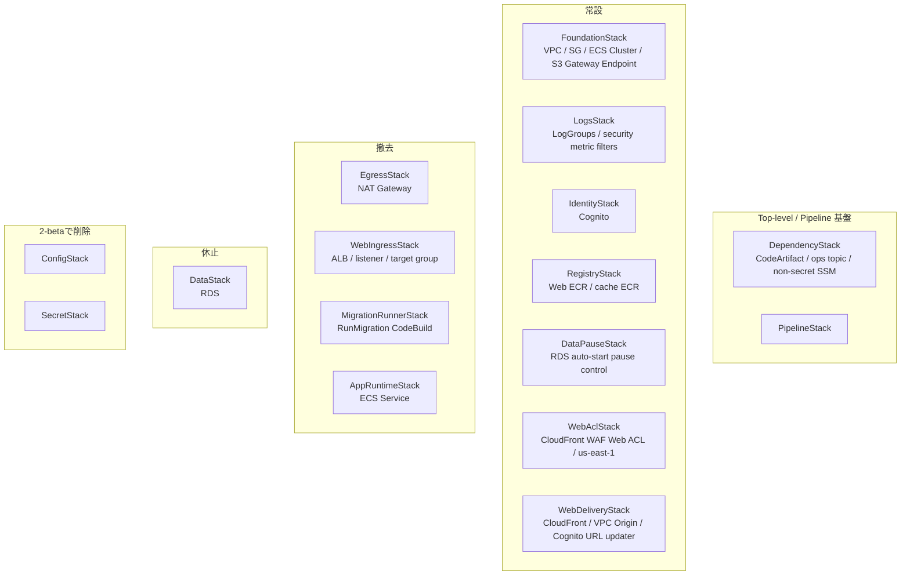
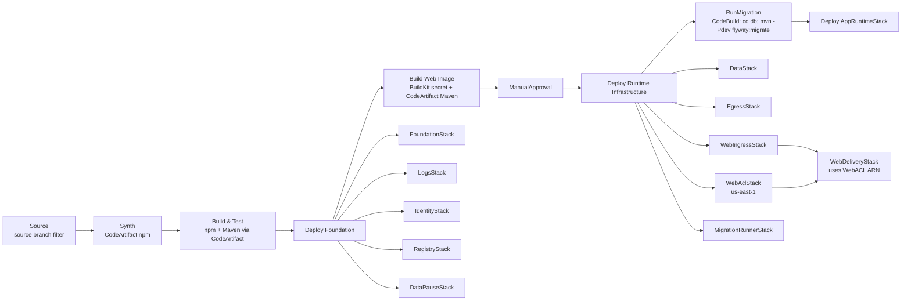
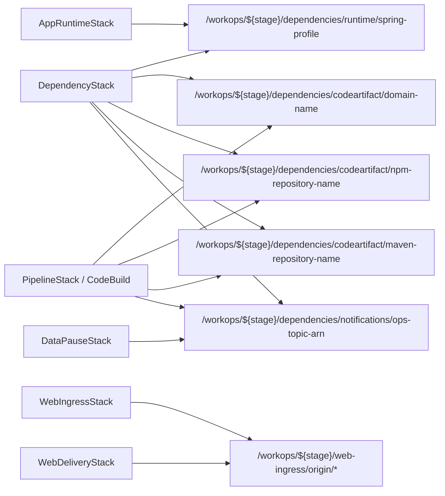
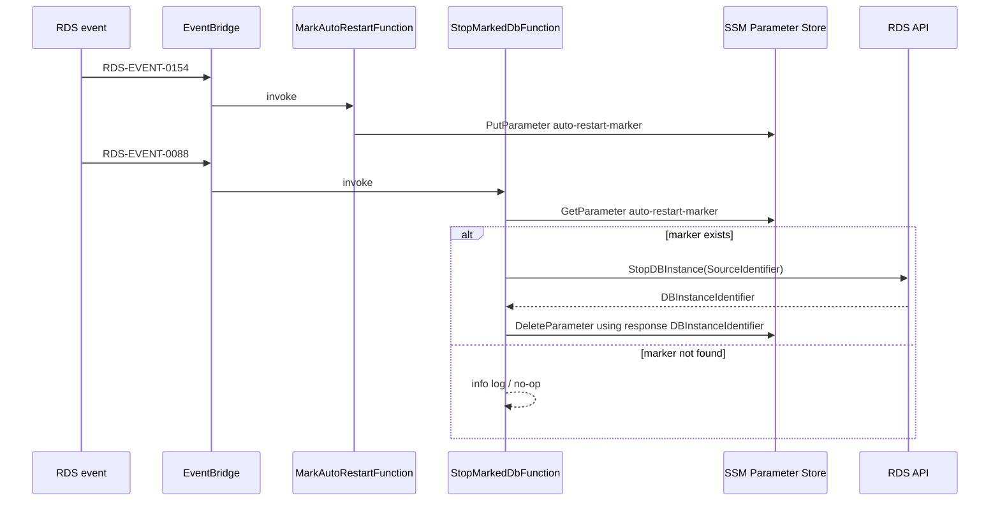

# Phase 2-beta Implementation Phases

このファイルは Phase 2α から分離した Phase 2-beta の実装計画を管理します。

## P2-beta. Pipeline 改善・Stack 分類再構成

### 目的

Phase 2α-3 でいったん完了扱いにした Pipeline を、初回 deploy と Pipeline 自走確認後に見えた改善点に基づいて再構成します。
Pipeline 遅延、承認位置、Stack 分類、Migration 実行方式、CodeArtifact、CDK entrypoint、RDS 休止運用を改善対象にします。

### 位置づけ

- Phase 2α-1 から Phase 2α-3 までの記録は履歴として残す
- Phase 2-beta 対象領域では Phase 2-beta 方針を後勝ちとする
- 詳細 agent task は `docs/implementation/phase2-beta/agent-tasks/P2-beta/` 配下で管理する
- コード、CDK、SQL、README の具体変更は P2-beta の詳細 task で扱う
- Notion 確定事項は再質問せず、実装・検証できる粒度へ変換する
- 実 AWS deploy と改善後 Pipeline 完走確認までを Phase 2-beta の完了範囲に含める

### Notion へ戻す判断

次に該当する場合は、リポジトリ側だけで確定せず Notion 側の要件・ADR 更新をユーザーへ確認します。

- Stack 分類、Pipeline stage 順序、ManualApproval 位置を変更する
- CodeArtifact、MigrationRunner、DataPause、WebDelivery / WebIngress の採用方針を変更する
- RDS 休止運用や実 AWS 確認の責務分担を変更する
- WAF、ECS Blue/Green alarm、認証・認可イベント metric filter のスコープを拡張する
- preview / staging / prod / cross-account 構成を Phase 2-beta に含める

### AWS 実環境確認の分担

- コーディングエージェントは `mvnw test`、CDK build / test / synth、template 確認、差分確認を担当する
- AWS CLI、CDK deploy、ECR push、Pipeline 実走確認は、ユーザーの明示依頼がある場合だけ実行する
- AWS 操作前には profile / region を明示し、credential 環境変数を削除してから `aws sts get-caller-identity --region $env:AWS_REGION` で認証先を確認する
- CloudFront 用 WAF と CDK Pipelines cross-region support を使うため、実 deploy 前に `ap-northeast-1` と `us-east-1` の両方を CDK bootstrap 済みにする
- 実 account ID、SSO role ARN、credential 値、RDS endpoint、secret 値、public IP、EC2 instance id は git 管理文書へ記録しない
- UI の最終操作確認、実 Cognito ログイン、実 AWS console 上の確認はユーザー確認として扱う

### 共通実装方針

- CDK entrypoint は `infra/cdk/bin/cdk.ts` に統合する
- `WORKOPS_STAGE` は人間が通常指定するstage正本にせず、Git source branchからstage keyを生成する
- CodePipeline Source actionはsource branchをrawのままbranch filterに指定する
- AWS resource name、SSM path、stackName、tagに使うstage keyはsource branchから決定的に生成する
- CDK app rootで `workops:stage` をcontextに設定し、naming / SSM path / tagだけに使うstage propsは削減する
- raw source branchは `PipelineStack` のSource action用propsとして渡し、Stack横断contextには置かない
- 通常手順は `cdk deploy '*'` / `cdk diff '*'` とし、個別 Stack 名指定は中間確認や初回 bootstrap の例外に限定する
- CDK Pipelines self-mutation は維持する
- Pipeline は RDS start / stop 運用に関心を持たず、CloudFormation deploy / update と migration 実行だけを扱う
- `ConfigStack` と空の `SecretStack` は削除する
- RDS master secret と DB 接続 SSM parameters は `DataStack` 所有のままとする
- Stage 境界をまたぐ非 secret 値は、所有Stackが SSM contract として公開し、consumer Stack が deploy 時に読む
- `StringParameter.valueFromLookup` と `Vpc.fromLookup` は使わず、consumer Stack 内で `StringParameter.valueForStringParameter` を使う
- Secret 値、credential 値、token 入り設定ファイルは git 管理しない
- 恒久手順に影響する変更は、該当 task 内で README / 開発手順も同時に更新する

### 成果物

- `bin/cdk.ts` 単一 entrypoint への整理方針
- Git source branchをPipeline filterとstage key生成へ使う方針
- CDK props境界の棚卸しと、naming / SSM path / tagだけに使うpropsの削減方針
- `DependencyStack` による CodeArtifact Maven / npm 依存取得基盤、ops notification topic、非 secret SSM parameters
- `MigrationRunnerStack` による VPC attached CodeBuild + Maven Flyway 実行方式
- `db/pom.xml` による DB migration 専用 Maven project
- `db/seed/dev` への seed directory 名寄せ
- `WebDeliveryStack` / `WebIngressStack` 分割方針
- Top-level / 常設 / 撤去 / 休止の Stack 分類
- `DataPauseStack` による RDS 7 日自動起動の再停止制御
- `WebAclStack` による CloudFront 用 WAF Web ACL
- ECS Blue/Green deployment failure detection 用 CloudWatch Alarm 2 本
- 認証・認可イベント用 CloudWatch Logs metric filter
- `ConfigStack` / `SecretStack` の削除方針
- CloudFormation Outputs 棚卸し方針

### Stack 分類

ライフサイクル分類と Pipeline stage 配置は別概念として扱います。



- `WebDeliveryStack` は常設ですが、CloudFront VPC Origin の接続先として `WebIngressStack` が公開する Web ingress origin contract を deploy 時に解決するため、Pipeline stage 上は `WebIngressStack` 後に配置する
- ADR-067 以降、Pipeline deploy 境界をまたぐ construct 参照は使わず、Foundation / Identity / Registry / WebAcl / WebIngress / WebDelivery の非 secret contract を SSM Standard Parameter で受け渡す
- `ConfigStack` と `SecretStack` は 2-beta で削除する。これはライフサイクル分類の「撤去」とは別の作業として扱う
- `DependencyStack` 所有の SSM parameters は `/workops/${stage}/dependencies/...` 配下に集約する
- `DataStack` 所有の DB 接続系 SSM parameters と RDS master secret は `DataStack` に残す
- `WebAclStack` は CloudFront 用 WAF Web ACL を所有するため `us-east-1` に置く
- `LogsStack` はアプリ LogGroup に対する認証・認可イベント metric filter も所有する

### Pipeline 配置



### CDK / Pipeline 方針

- `cdk.json` / `package.json` は標準寄りに整理し、複数 entrypoint を `bin/cdk.ts` に統合する
- 初回 bootstrap だけ `DependencyStack` → `PipelineStack` の先行 deploy 例外を認める
- `BuildImages` は廃止し、Pipeline stage / wave 名は `BuildWebImage` に統一してManualApproval 前に置く
- migration image は作らない
- ManualApproval は課金が始まる手前の唯一の関門とする
- `RunMigration` は CodeBuild build status で成功判定する
- ECS RunTask exit code 解釈は廃止する

### DependencyStack / SSM 方針

`DependencyStack` は CodeArtifact、ops notification topic、依存基盤の非 secret SSM parameters を所有します。
ADR-067 以降は deploy Stage 境界の非 secret 値も各所有Stackが SSM contract として公開し、consumer Stack が自分の Stack scope で読みます。

- 旧 `/workops/${stage}/spring/profile` は維持しない
- SSM parameters は明示名 + `RemovalPolicy.DESTROY` とする
- CodeArtifact endpoint、authorization token、AWS account ID、domain-owner は SSM に保存しない
- DB password、CodeArtifact token、credential値は Stage 境界 contract に保存しない
- Phase 2β の subnet contract は 2AZ 分の subnet ID / AZ / route table ID を個別 parameter とし、subnet list token は使わない
- `DependencyStack` 所有の SSM parameters は次に固定する

```text
/workops/${stage}/dependencies/runtime/spring-profile
/workops/${stage}/dependencies/codeartifact/domain-name
/workops/${stage}/dependencies/codeartifact/npm-repository-name
/workops/${stage}/dependencies/codeartifact/maven-repository-name
/workops/${stage}/dependencies/notifications/ops-topic-arn
```



### CodeArtifact 方針

- domain は 1 つ、repository は npm / Maven で分ける
- npmjs / Maven Central への external connection / upstream を設定する
- CodeBuild 実行時に動的に設定し、token 入り `.npmrc` / `settings.xml` は git 管理しない
- npm は `aws codeartifact login --tool npm` を使う
- Maven は一時 `settings.xml` を生成し、`${env.CODEARTIFACT_AUTH_TOKEN}` を使う
- Maven settings では `mirrorOf=central` を設定する
- helper script は `infra/cdk/scripts/` 配下の Python として npm / Maven で分ける
- helper は AWS profile を受け取らず、CodeBuild role 認証に任せる
- CI では `npm ci` を維持し、`npm install` には変えない
- CodeArtifact package cleanup / retention の独自実装はしない

### Migration / DB 方針

- RunMigration CodeBuild は Docker を使わず、CodeBuild host 上で `cd db; mvn -Pdev flyway:migrate` を実行する
- `db/pom.xml` は独立した最小 Maven project とし、Spring Boot parent や `apps/web` parent は継承しない
- `db/` は Java source を持たず、Flyway Maven plugin 専用とする
- `db/` に Maven wrapper は置かない
- Flyway locations は POM profile に固定する
  - local: `migration`, `seed/common`, `seed/local`
  - dev: `migration`, `seed/common`, `seed/dev`
- DB 接続値は `WORKOPS_DB_URL` / `WORKOPS_DB_USERNAME` / `WORKOPS_DB_PASSWORD` を使う
- `WORKOPS_DB_URL` は SSM、username / password は `/workops/${stage}/db/master` の secret JSON から取得する
- 旧 AWS dev 用 seed directory は `db/seed/dev` に統一し、旧 directory 名は残さない

### Docker build 方針

- Docker build 内の Maven 依存取得は CodeArtifact を使う
- token / settings は build arg ではなく Docker BuildKit secret で渡す
- `apps/web/Dockerfile` は syntax directive と secret mount に対応させる
- CI の image build では `maven_settings` secret を必須にする

### MigrationRunner 方針

- 旧 `MigrationStack` / migration image / ECS RunTask 方式は廃止する
- `MigrationRunnerStack` / VPC attached CodeBuild / Maven Flyway 実行へ一本化する
- CodeBuild project 名は `workops-${stage}-migration-runner` とする
- RunMigration stage 名は維持する
- `MigrationRunnerStack` は撤去分類に含める
- VPC mode + app private subnet + `migration-sg` を使う
- RDS 接続は `migration-sg` → `db-sg` の TCP 3306 ingress を維持する

### WebDelivery / WebIngress 方針

- 旧 `EdgeStack` は `WebDeliveryStack` / `WebIngressStack` に分割する
- 分割目的は CloudFront 15 分を完全になくすことではなく、CloudFront / VPC Origin / Cognito updater を長時間・低頻度変更側へ隔離すること
- 既存記録上の `EdgeStack` deploy 約 15 分 11 秒を実測根拠とする
- `WebDeliveryStack` は CloudFront Distribution / VPC Origin / Cognito URL updater を所有する
- `WebIngressStack` は ALB / listener / target group / ALB SG ingress を所有する
- `WebIngressStack` は CloudFront VPC Origin の接続先として使う Web ingress origin contract を SSM へ書く
- Web ingress origin contract は `/workops/${stage}/web-ingress/origin/alb-arn`、`/workops/${stage}/web-ingress/origin/alb-dns-name`、`/workops/${stage}/web-ingress/origin/alb-security-group-id` とする
- AppRuntime 用 contract として `/workops/${stage}/web-ingress/listener/http-listener-arn` と `/workops/${stage}/web-ingress/alb-full-name` も公開する
- `WebDeliveryStack` は Web ingress origin contract を SSM deploy 時解決で読み、synth 時 lookup はしない
- `WebDeliveryStack` は SSM から復元した `IApplicationLoadBalancer` を `VpcOrigin.withApplicationLoadBalancer` に渡し、`AWS::CloudFront::VpcOrigin` と CloudFront Distribution を同じ Stack で管理する
- `AWS::CloudFront::VpcOrigin` の `VpcOriginEndpointConfig.Arn` に必要なのは VPC Origin 自体の ARN ではなく、origin endpoint として使う ALB ARN である
- `AppRuntimeStack` と `WebIngressStack` の listener / target group 連携は SSM contract 経由で行い、Stage 境界をまたぐ props 参照は使わない
- `WebIngressStack` 再作成時に `WebDeliveryStack` 更新が必要になり、CloudFront 待ち時間が発生し得ることは受け入れる

### DataStack / RDS 休止方針

- `DataStack` は休止分類とする
- Pipeline が扱うのは CloudFormation deploy / update とする
- RDS の通常起動 / 停止は人間運用とする
- RDS 停止中なら RunMigration は失敗し得ることを記録する

### DataPauseStack 方針

`DataPauseStack` は RDS 休止運用を支える常設 Stack とします。
定期 Scheduler と CloudTrail `LookupEvents` は採用せず、RDS event ID と SSM marker で停止可否を判断します。



- EventBridge Rule は `RDS-EVENT-0154` 用と `RDS-EVENT-0088` 用の 2 個にする
- Lambda は `MarkAutoRestartFunction` と `StopMarkedDbFunction` の 2 個にする
- marker path は `/workops/${stage}/data-pause/${sourceIdentifier}/auto-restart-marker` とする
- marker value は固定文字列 `RDS-EVENT-0154` とする
- `StopMarkedDbFunction` は `RDS-EVENT-0088` の `SourceIdentifier` で `StopDBInstance` を呼び、response の `DBInstanceIdentifier` から marker path を組み立てて削除する
- `ParameterNotFound` は正常系 no-op とし、それ以外の失敗は throw して Lambda Errors alarm に出す
- `RDS-EVENT-0087`、CloudTrail、定期 Scheduler、`DescribeDBInstances` は採用しない
- Pipeline は RDS start / stop 運用に関心を持たない

### Lambda / Cognito updater 方針

- Lambda 実行コードは `infra/cdk/lambda/` に統一する
- 既存 `infra/cdk/custom-resources/cognito-client-url-updater/` は `infra/cdk/lambda/cognito-client-url-updater/` へ移す
- `custom-resources/` は削除対象とする
- Cognito URL updater も Node.js 24.x へ更新し、AWS SDK は bundle する
- DataPause Lambda も TypeScript / Node.js 24.x とする
- 共通 bundling helper は作らない
- `aws-sdk-client-mock` で DataPause と Cognito updater の handler 単体テストを追加する
- Cognito URL updater は `DescribeUserPoolClient` → `UpdateUserPoolClient` の流れを mock 検証する

### Foundation / Logs / Identity / Registry 方針

- `FoundationStack` は VPC / subnets / security groups / ECS cluster / S3 Gateway Endpoint を所有する
- S3 Gateway Endpoint は app private subnet route table のみ、default policy とする
- Interface Endpoint は作らない
- `EgressStack` は NAT Gateway を所有し、撤去分類とする
- `LogsStack` は LogGroup と認証・認可イベント metric filter を所有する
- ops notification topic は `DependencyStack` へ移す
- DataPause 用 LogGroup は次の 2 本を作る
  - `/workops/${stage}/data-pause/mark-auto-restart`
  - `/workops/${stage}/data-pause/stop-marked-db`
- `IdentityStack` は Cognito 本体を常設で所有する
- `RegistryStack` は Web image repository / Web cache repository だけを所有する
- api / batch repository は先行作成しない

### WAF 方針

`WebAclStack` は CloudFront 前段の WAF Web ACL を所有する常設 Stack とします。
CloudFront 用 Web ACL は AWS 仕様に合わせて `us-east-1` に作成します。

- AWS Managed Rules Common Rule Set を Count mode で有効化する
- Bot Control、Fraud Control、CAPTCHA、Challenge、Marketplace managed rule は使わない
- WAF log は作成する
- stage 別の WAF log retention / destination 方針は後続 TODO とし、Phase 2β の現時点では扱わない

### ECS Blue/Green Alarm 方針

ECS Native Blue/Green の deployment failure detection では、bake time 3 分中に CloudWatch Alarm 2 本を連動させます。
低トラフィックの dev / portfolio 用途であるため、HTTP 5xx や TargetResponseTime ではなく、ALB Target Group の health 状態を中心に判定します。

- `HealthyHostCount < 1`
- `UnHealthyHostCount > 0`
- `HTTPCode_Target_5XX_Count` や `TargetResponseTime` は将来の traffic 増加、synthetic check 導入、数値 SLO 導入時の追加候補とする

### 認証・認可イベント metric filter 方針

認証・認可イベントログに対し、CloudWatch Logs metric filter を最小限追加します。
Alarm 通知や Dashboard は Phase 2β では作りません。

- `AUTHORIZATION_DENIED`
- `USER_NOT_LINKED`
- `ACTOR_TYPE_MISMATCH`
- `INVALID_ACTOR_TYPE`
- `PERMISSION_SET_NOT_ASSIGNED`
- `INVALID_PERMISSION_SET`

### 詳細 task

P2-beta は次の 10 task に分けます。

1. `P2-beta-01-cdk-entrypoint-dependency-stack.md`
2. `P2-beta-02-codeartifact-build-integration.md`
3. `P2-beta-03-db-maven-flyway.md`
4. `P2-beta-04-migration-runner-stack.md`
5. `P2-beta-05-web-delivery-ingress-split.md`
6. `P2-beta-06-data-pause-stack.md`
7. `P2-beta-07-cdk-stage-source-branch-and-props-boundary.md`
8. `P2-beta-08-permanent-baseline-deploy-check.md`
9. `P2-beta-09-pipeline-stage-recomposition.md`
10. `P2-beta-10-outputs-cleanup-and-docs.md`

### 完了条件

- 親計画、実装、ローカル検証、CDK synth、実 AWS deploy、改善後 Pipeline 完走確認が完了している
- 改善後 Pipeline が source branch push 起点で 1 周し、ManualApproval 後に RunMigration と AppRuntime deploy まで完了している
- CloudFront default domain 経由でアプリへ到達できる
- 撤去分類の Stack を撤去でき、DataStack は休止運用へ戻せる
- RDS 停止中に RunMigration が失敗し得ることがトラブルシュート手順に記録されている
- 不要 CloudFormation Outputs と Sensitive Output Rule 違反の Outputs が削除されている
- WAF Web ACL が Count mode で CloudFront に関連付けられている
- ECS Blue/Green alarm が target health 中心の 2 本になっている
- 認証・認可イベント metric filter が Alarm / Dashboard なしで追加されている

### 除外範囲

- apps/api / apps/batch の実装
- preview / staging / prod / cross-account 構成
- 定期 Scheduler による RDS 再停止
- Stack 名指定を通常手順にする運用
- CodeArtifact package cleanup の独自実装
